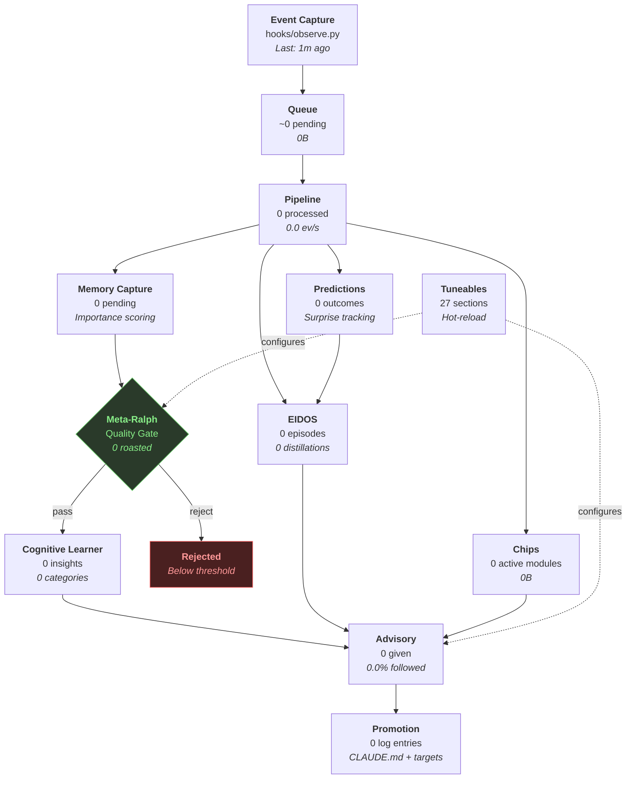

# Spark Intelligence Observatory

> Last generated: 2026-02-22 17:41:59
> Pipeline: 0 events processed, 0 insights created

## System Health

| Metric | Value | Status |
|--------|-------|--------|
| Queue depth | ~0 pending | healthy |
| Last pipeline cycle | never | healthy |
| Processing rate | 0.0 ev/s | healthy |
| Events processed | 0 | healthy |
| Insights created | 0 | healthy |
| Pending memories | 0 | healthy |
| Meta-Ralph roasted | 0 | healthy |
| Meta-Ralph pass rate | 0.0% | CRITICAL |
| Meta-Ralph avg score | 0.0 | healthy |
| Cognitive insights | 0 | healthy |
| EIDOS episodes | 0 | healthy |
| EIDOS distillations | 0 | healthy |
| Advisory given | 0 | healthy |
| Advisory followed | 0.0% | healthy |
| Advisory emit rate | 0.0% | WARNING |
| Implicit follow rate | 0.0% | WARNING |
| Promotion log entries | 0 | healthy |
| Active chips | 0 | healthy |

## Intelligence Flow

## Stage Detail Pages

1. [[stages/01-event-capture|Event Capture]] — Hook integration, session tracking, predictions
2. [[stages/02-queue|Queue]] — Event buffering, overflow, compaction
3. [[stages/03-pipeline|Pipeline]] — Batch processing, priority ordering, learning yield
4. [[stages/04-memory-capture|Memory Capture]] — Importance scoring, domain detection, pending items
5. [[stages/05-meta-ralph|Meta-Ralph]] — Quality gate, roast verdicts, noise filtering
6. [[stages/06-cognitive-learner|Cognitive Learner]] — Insight store, categories, reliability tracking
7. [[stages/07-eidos|EIDOS]] — Episodes, steps, distillations, predict-evaluate loop
8. [[stages/08-advisory|Advisory]] — Retrieval, ranking, emission, effectiveness feedback
9. [[stages/09-promotion|Promotion]] — Target files, criteria, promotion log
10. [[stages/10-chips|Chips]] — Domain modules, per-chip activity
11. [[stages/11-predictions|Predictions]] — Outcomes, links, surprise tracking
12. [[stages/12-tuneables|Tuneables]] — Configuration, hot-reload, all sections

## How Data Flows

- An **event** enters via [[stages/01-event-capture|Event Capture]] and lands in the [[stages/02-queue|Queue]]
- The [[stages/03-pipeline|Pipeline]] processes batches, feeding [[stages/04-memory-capture|Memory Capture]]
- [[stages/05-meta-ralph|Meta-Ralph]] gates every insight before it enters [[stages/06-cognitive-learner|Cognitive Learner]]
- [[stages/08-advisory|Advisory]] retrieves from [[stages/06-cognitive-learner|Cognitive Learner]], [[stages/07-eidos|EIDOS]], and [[stages/10-chips|Chips]]
- High-confidence insights get [[stages/09-promotion|promoted]] to CLAUDE.md
- [[stages/11-predictions|Predictions]] close the loop: predict, observe, evaluate, learn

## Quick Links

- [[explore/_index|Explore Individual Items]] — browse cognitive insights, distillations, episodes, verdicts
- [[../watchtower|Advisory Watchtower]] — existing advisory deep-dive
- [[../packets/index|Advisory Packet Catalog]] — existing packet view
