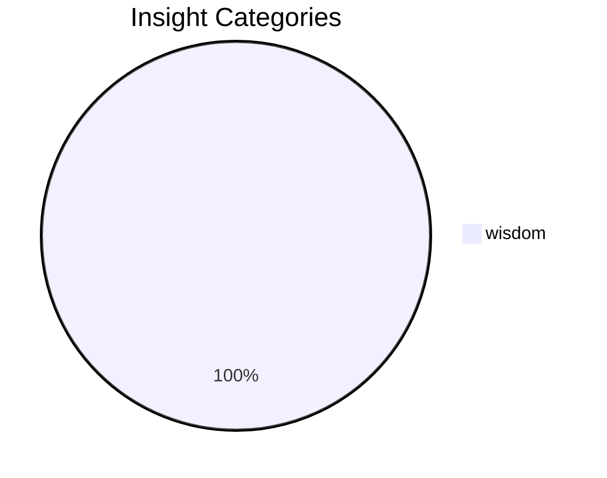

# Stage 6: Cognitive Learner

> Part of the [[../flow|Intelligence Flow]]
> Upstream: [[05-meta-ralph|Meta-Ralph]]
> Downstream: [[08-advisory|Advisory]] | [[09-promotion|Promotion]]

**Purpose:** Stores refined insights with reliability tracking, validation counts, and promotion status. Noise filter: 41 patterns. Deduplication via similarity threshold.
## Health

| Metric | Value | Status |
|--------|-------|--------|
| Total insights | 1 | healthy |
| Categories | 1 | healthy |
| Last updated | 1.1d ago | healthy |
## Category Distribution

## Top Insights (by reliability)

| Key | Category | Reliability | Validations | Promoted | Insight |
|-----|----------|-------------|-------------|----------|--------|
| `wisdom:agent_avoids:_estilo_tinysaas_colorido_e` | wisdom | 95% | 0 | — | Agent avoids: Estilo TinySaaS colorido em posts sociais (percepção carnavalesca) |

## Source Files

- `lib/cognitive_learner.py` — Core implementation
- `~/.spark/cognitive_insights.json` — State storage
- `~/.spark/cognitive_metrics.json` — State storage
